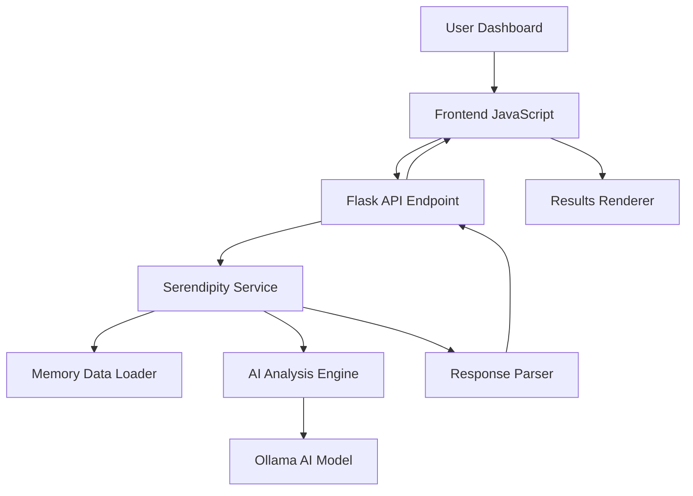

# Design Document

## Overview

The Serendipity Analysis feature is a sophisticated AI-powered system that discovers hidden connections, patterns, and insights within a user's accumulated cognitive memory. The system transforms raw conversation data and extracted insights into meaningful discoveries through specialized AI analysis, providing users with unexpected perspectives on their own thought patterns and interests.

The feature operates as a complete end-to-end pipeline: user interaction → data loading → AI analysis → result presentation, with robust error handling and performance considerations throughout.

## Architecture

### High-Level Architecture



### Component Interaction Flow

1. **User Interaction Layer**: Dashboard UI with "Discover Connections" button
2. **Frontend Controller**: JavaScript handling UI state and API communication
3. **Backend API**: Flask endpoint managing requests and responses
4. **Service Layer**: SerendipityService orchestrating the analysis workflow
5. **Data Layer**: Memory.json file containing insights and conversation summaries
6. **AI Layer**: Ollama model performing connection discovery analysis
7. **Presentation Layer**: Dynamic HTML generation for displaying results

## Components and Interfaces

### Frontend Components

#### Dashboard Controller (`static/js/dashboard.js`)
- **Purpose**: Manages serendipity analysis UI interactions
- **Key Methods**:
  - `discoverConnections()`: Initiates analysis workflow
  - `renderSerendipityResults()`: Displays analysis results
  - `renderConnections()`: Renders individual connection cards
  - `renderMetaPatterns()`: Displays overarching patterns
  - `renderRecommendations()`: Shows actionable recommendations

#### UI State Management
- **Loading State**: Button disabled, loading message displayed
- **Success State**: Results rendered with formatted connections
- **Error State**: Error message with retry guidance
- **Empty State**: Guidance for insufficient data scenarios

### Backend Components

#### API Endpoint (`/api/serendipity`)
- **Methods**: GET (status), HEAD (availability), POST (analysis)
- **Request Validation**: JSON format validation
- **Response Format**: Structured JSON with connections, patterns, and metadata
- **Error Handling**: Sanitized error messages with fallback responses

#### SerendipityService Class
- **Core Methods**:
  - `analyze_memory()`: Main analysis workflow orchestrator
  - `load_memory_data()`: Loads and validates memory.json
  - `discover_connections()`: AI-powered connection discovery
  - `_format_memory_for_analysis()`: Prepares data for AI consumption

#### Memory Data Interface
```python
{
    "insights": [
        {
            "category": str,
            "content": str,
            "confidence": float,
            "tags": List[str],
            "evidence": str,
            "timestamp": str
        }
    ],
    "conversation_summaries": [
        {
            "summary": str,
            "key_themes": List[str],
            "timestamp": str
        }
    ],
    "metadata": {
        "total_insights": int,
        "last_updated": str
    }
}
```

## Data Models

### Input Data Model (Memory Structure)
- **Insights**: Categorized user insights with confidence scores and evidence
- **Conversation Summaries**: High-level summaries of past conversations
- **Metadata**: Statistical information about the memory database

### AI Analysis Request Model
```python
{
    "formatted_memory": str,  # Structured text for AI analysis
    "analysis_prompt": str,   # Specialized connection discovery prompt
    "model_config": {
        "model": "llama3:8b",
        "temperature": 0.7,
        "max_tokens": 4000
    }
}
```

### AI Response Model
```python
{
    "connections": [
        {
            "title": str,
            "description": str,
            "surprise_factor": float,  # 0.0-1.0
            "relevance": float,        # 0.0-1.0
            "connected_insights": List[str],
            "connection_type": str,
            "actionable_insight": str
        }
    ],
    "meta_patterns": [
        {
            "pattern_name": str,
            "description": str,
            "evidence_count": int,
            "confidence": float
        }
    ],
    "serendipity_summary": str,
    "recommendations": List[str]
}
```

### Frontend Display Model
- **Connection Cards**: Visual representation with progress bars for surprise/relevance
- **Meta Pattern Cards**: Overarching themes with confidence indicators
- **Summary Section**: Markdown-rendered analysis overview
- **Recommendations List**: Actionable next steps for the user

## Error Handling

### Data Validation Errors
- **Insufficient Data**: Less than 3 insights available
  - Response: Guidance message with recommendations for more conversations
  - UI: Special empty state with actionable advice

- **Corrupted Memory File**: Invalid JSON or missing required fields
  - Response: Error message with file recovery suggestions
  - UI: Error state with retry option

### AI Service Errors
- **Model Unavailable**: Ollama service not responding
  - Response: Service unavailable message with retry guidance
  - UI: Error state with system status information

- **Invalid AI Response**: Non-JSON or malformed response from AI
  - Response: Parsing error with fallback empty results
  - UI: Partial results display with error notification

### Network and System Errors
- **Request Timeout**: Long-running AI analysis exceeds timeout
  - Response: Timeout message with system performance context
  - UI: Loading state with progress indication

- **Memory Constraints**: Insufficient system resources
  - Response: Resource limitation message
  - UI: Error state with system optimization suggestions

### Error Recovery Strategies
1. **Graceful Degradation**: Partial results when possible
2. **User Guidance**: Clear instructions for resolution
3. **Retry Mechanisms**: Automatic and manual retry options
4. **Fallback Responses**: Meaningful empty states

## Testing Strategy

### Unit Testing
- **SerendipityService Methods**: Test data loading, formatting, and parsing
- **Memory Data Validation**: Test various data scenarios and edge cases
- **AI Response Parsing**: Test JSON extraction and validation
- **Error Handling**: Test all error conditions and recovery paths

### Integration Testing
- **API Endpoint Testing**: Test complete request/response cycle
- **AI Service Integration**: Test with mock and real AI responses
- **Memory File Integration**: Test with various memory file states
- **Frontend-Backend Integration**: Test complete user workflow

### End-to-End Testing
- **Complete User Journey**: From button click to results display
- **Error Scenarios**: Test user experience during various error conditions
- **Performance Testing**: Test with large memory datasets
- **Browser Compatibility**: Test UI rendering across different browsers

### Test Data Scenarios
1. **Minimal Data**: 1-2 insights (insufficient data scenario)
2. **Optimal Data**: 10-20 insights with diverse categories
3. **Large Dataset**: 100+ insights (performance testing)
4. **Corrupted Data**: Invalid JSON, missing fields
5. **Empty Data**: No insights or summaries

### Performance Testing
- **Memory Loading**: Test with various file sizes
- **AI Response Time**: Monitor analysis duration
- **UI Rendering**: Test with large result sets
- **Concurrent Requests**: Test multiple simultaneous analyses

### Security Testing
- **Input Validation**: Test malformed requests
- **Error Message Sanitization**: Ensure no sensitive data exposure
- **Memory Data Protection**: Test access controls
- **XSS Prevention**: Test result rendering security

## Implementation Considerations

### Performance Optimizations
- **Multi-Level Caching**: Implement memory data caching, AI response caching, and result caching
- **AI Response Streaming**: Consider streaming for long analyses with progress indicators
- **Result Pagination**: Handle large connection sets efficiently with lazy loading
- **Resource Monitoring**: Track system resources and optimize based on usage patterns

### Scalability Considerations
- **Memory File Size**: Handle growing memory databases with efficient parsing and chunking
- **AI Model Selection**: Support different models based on data size and complexity
- **Result Storage**: Implement persistent caching with TTL for analysis results
- **Concurrent Analysis**: Handle multiple user requests with queue management

### Security Measures
- **Data Sanitization**: Clean all user-facing error messages and remove sensitive information
- **Input Validation**: Validate all API requests with comprehensive sanitization
- **Memory Access Control**: Ensure proper file access permissions and secure data handling
- **XSS Prevention**: Sanitize all rendered content and use secure HTML generation

### Integration with Synapse Project
- **Configuration Management**: Integrate with existing config.py and environment variable system
- **Database Integration**: Ensure compatibility with existing data storage patterns
- **Authentication**: Respect existing user authentication and session management
- **Styling Consistency**: Use existing CSS framework and maintain visual consistency

### Accessibility and Responsive Design
- **WCAG Compliance**: Ensure all components meet WCAG 2.1 AA standards
- **Responsive Layout**: Implement mobile-first design with progressive enhancement
- **Keyboard Navigation**: Full keyboard accessibility for all interactive elements
- **Screen Reader Support**: Comprehensive ARIA labels and semantic HTML structure

### Monitoring and Logging
- **Analysis Metrics**: Track success rates, performance, and user engagement
- **Error Tracking**: Monitor and alert on error patterns with detailed logging
- **Usage Analytics**: Track feature adoption and usage patterns for optimization
- **Performance Monitoring**: Monitor AI response times, system resources, and user experience metrics